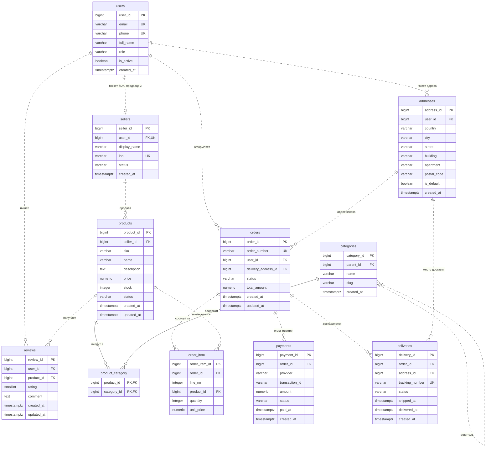

# Лабораторная работа №1. Проектирование и реализация структуры базы данных маркетплейса

| | |
|---|---|
| **Студент** | _ФИО_ |
| **Группа** | _номер группы_ |
| **СУБД** | PostgreSQL (проверено на 16.15) |
| **Схема БД** | `marketplace` |
| **Папка в репозитории** | `lab01/` |

---

## 1. Постановка задачи

Спроектировать и реализовать в PostgreSQL структуру базы данных маркетплейса — торговой площадки, где независимые продавцы выставляют товары, а покупатели оформляют, оплачивают и получают заказы и оставляют отзывы.

Необходимо выполнить:

1. Проанализировать предметную область и сформулировать бизнес-правила.
2. Построить ER-диаграмму не менее чем из 10 сущностей, с хотя бы одной связью «многие-ко-многим» через ассоциативную таблицу и хотя бы одной иерархической связью (самоссылкой).
3. Привести схему к третьей нормальной форме; на примере одной таблицы показать аномалию до нормализации и как она устранена.
4. Определить первичный ключ каждой таблицы и обосновать выбор суррогатных/естественных ключей.
5. Реализовать схему средствами DDL: типы, PRIMARY KEY, FOREIGN KEY, NOT NULL, UNIQUE, CHECK, DEFAULT, правила ON DELETE / ON UPDATE.
6. Составить словарь данных.
7. Оформить всё единым SQL-скриптом, повторный запуск которого воссоздаёт схему с нуля.

**Выполнение требований к оформлению**

| Требование | Как выполнено |
|---|---|
| СУБД PostgreSQL 15+ | Скрипты проверены на PostgreSQL 16.15 |
| Воспроизводимый скрипт | `01_schema.sql` начинается с `DROP SCHEMA IF EXISTS marketplace CASCADE` — повторный запуск воссоздаёт схему с нуля (проверено двукратным запуском) |
| Осмысленные имена, латиница, snake_case | Единый стиль: `pk`/`fk_`/`uq_`/`ck_` — префиксы ограничений, `ix_` — индексов |
| Отчёт | Этот файл |
| Репозиторий, каждая работа в отдельной папке | Папка `lab01/` (структура — в разделе 8) |
| Сквозная БД | Схема `marketplace` из `01_schema.sql` используется в следующих работах; изменения будут вноситься отдельными миграциями, а не правкой этого скрипта |

---

## 2. Анализ предметной области и бизнес-правила

### 2.1. Описание предметной области

В системе действуют **пользователи**. Пользователь может быть покупателем, администратором или (при наличии профиля) продавцом. У пользователя может быть несколько адресов доставки.

**Продавец** выставляет **товары**. Каждый товар принадлежит ровно одному продавцу и относится к одной или нескольким **категориям**; категории образуют дерево (Электроника → Телефоны → Смартфоны).

**Покупатель** оформляет **заказ** на выбранный адрес доставки. Заказ состоит из **позиций** (товар, количество, цена на момент покупки). Заказ оплачивается **платежами** и передаётся в **доставку**. Купленные товары покупатель может оценить и оставить **отзыв**.

### 2.2. Бизнес-правила

| № | Бизнес-правило | Чем обеспечено в схеме |
|---|---|---|
| БП-1 | Пользователь идентифицируется уникальным e-mail; телефон, если указан, тоже уникален. Допустимые роли: customer, seller, admin | `uq_users_email`, `uq_users_phone`, `ck_users_role`, `ck_users_email` |
| БП-2 | Продавец — это пользователь с профилем продавца; у пользователя не более одного профиля; ИНН уникален и состоит из 10–12 цифр | `sellers.user_id` UNIQUE, `uq_sellers_inn`, `ck_sellers_inn` |
| БП-3 | У пользователя может быть несколько адресов доставки; удаление пользователя удаляет его адреса (если они не используются в заказах) | `addresses.user_id` FK, ON DELETE CASCADE |
| БП-4 | **У товара ровно один продавец**; артикул (SKU) уникален в пределах продавца | `products.seller_id NOT NULL` + FK, `uq_products_seller_sku` |
| БП-5 | Категории образуют иерархию: у категории не более одного родителя, категория не может быть родителем самой себе; товар может относиться к нескольким категориям, а категория содержать много товаров | `categories.parent_id` (самоссылка), `ck_categories_no_self`, ассоциативная таблица `product_category` |
| БП-6 | Цена и остаток товара не могут быть отрицательными; статус товара — draft, active или archived | `ck_products_price`, `ck_products_stock`, `ck_products_status` |
| БП-7 | **Заказ принадлежит ровно одному покупателю**, имеет уникальный номер, адрес доставки и статус жизненного цикла | `orders.user_id NOT NULL` + FK, `uq_orders_number`, `delivery_address_id NOT NULL`, `ck_orders_status` |
| БП-8 | **Заказ содержит хотя бы одну позицию**; позиции нумеруются, количество положительно, цена фиксируется на момент покупки | `uq_order_item_order_line`, `ck_order_item_qty`, `ck_order_item_line`, `unit_price`. Условие «хотя бы одна позиция» декларативно не выражается и в этой работе не реализовано (см. раздел 10) |
| БП-9 | Заказ можно оплачивать несколькими платежами (повторные попытки, возвраты); сумма платежа положительна; транзакция провайдера уникальна | `payments.order_id` FK (1:N), `ck_payments_amount`, `ck_payments_status`, `uq_payments_tx` |
| БП-10 | Заказ может доставляться несколькими отправлениями (например, товары разных продавцов); трек-номер уникален | `deliveries.order_id` FK (1:N), `uq_deliveries_tracking`, `ck_deliveries_status` |
| БП-11 | **Отзыв оставляется к конкретному товару конкретным пользователем**, не более одного отзыва на пару; оценка от 1 до 5 | `uq_reviews_user_product`, `ck_reviews_rating` |
| БП-12 | Историю заказов нельзя разрушить: нельзя физически удалить пользователя с заказами, продавца с товарами, товар из заказа, адрес из заказа | ссылочные действия ON DELETE RESTRICT (раздел 6.3) |
| БП-13 | Дата изменения товара, заказа и отзыва обновляется автоматически | триггеры `trg_products_updated`, `trg_orders_updated`, `trg_reviews_updated` |

---

## 3. Сущности и ER-диаграмма

### 3.1. Перечень сущностей

В схеме **11 сущностей** (требовалось не менее 10).

| № | Сущность | Тип | Назначение |
|---|---|---|---|
| 1 | `users` | основная | учётные записи |
| 2 | `addresses` | зависимая | адреса пользователей |
| 3 | `sellers` | зависимая (1:1 с `users`) | профили продавцов |
| 4 | `categories` | справочная, иерархическая | дерево категорий |
| 5 | `products` | основная | товары |
| 6 | `product_category` | ассоциативная | связь товар ↔ категория (M:N) |
| 7 | `orders` | основная | заказы |
| 8 | `order_item` | ассоциативная с атрибутами | позиции заказа (заказ ↔ товар, M:N) |
| 9 | `payments` | зависимая | платежи |
| 10 | `deliveries` | зависимая | доставки |
| 11 | `reviews` | ассоциативная с атрибутами | отзывы (пользователь ↔ товар, M:N) |

### 3.2. ER-диаграмма

Диаграмма построена в расширении ERD Editor для VS Code (файл `marketplace.vuerd.json`). Скриншот вставляется сюда: <!--  -->

Та же диаграмма в текстовом виде (нотация «вороньей лапки»; сплошная линия — идентифицирующая связь, пунктир — неидентифицирующая; PK — первичный ключ, FK — внешний, UK — уникальный):



### 3.3. Связи и кардинальности

| Родитель (1) | Дочерняя таблица | Кардинальность | Внешний ключ |
|---|---|---|---|
| `users` | `addresses` | 1 — 0..N | `addresses.user_id` |
| `users` | `sellers` | 1 — 0..1 | `sellers.user_id` (UNIQUE) |
| `users` | `orders` | 1 — 0..N | `orders.user_id` |
| `users` | `reviews` | 1 — 0..N | `reviews.user_id` |
| `sellers` | `products` | 1 — 0..N | `products.seller_id` |
| `categories` | `categories` | 1 — 0..N | `categories.parent_id` (самоссылка) |
| `products` | `product_category` | 1 — 0..N | `product_category.product_id` |
| `categories` | `product_category` | 1 — 0..N | `product_category.category_id` |
| `orders` | `order_item` | 1 — 1..N | `order_item.order_id` |
| `products` | `order_item` | 1 — 0..N | `order_item.product_id` |
| `orders` | `payments` | 1 — 0..N | `payments.order_id` |
| `orders` | `deliveries` | 1 — 0..N | `deliveries.order_id` |
| `addresses` | `deliveries` | 1 — 0..N | `deliveries.address_id` |
| `addresses` | `orders` | 1 — 0..N | `orders.delivery_address_id` |
| `products` | `reviews` | 1 — 0..N | `reviews.product_id` |

### 3.4. Связи «многие-ко-многим» и иерархия

Схема содержит три связи M:N, каждая разложена на две связи 1:N через ассоциативную таблицу:

- **товар ↔ категория** — таблица `product_category` с составным первичным ключом `(product_id, category_id)`; собственных атрибутов нет;
- **заказ ↔ товар** — таблица `order_item`; атрибуты связи: `line_no`, `quantity`, `unit_price`;
- **пользователь ↔ товар** — таблица `reviews`; атрибуты связи: `rating`, `comment`; пара `(user_id, product_id)` уникальна, поэтому пользователь оценивает товар не более одного раза.

**Иерархическая связь** — `categories.parent_id → categories.category_id` (самоссылка). Выбрана модель «список смежности» (adjacency list): она проста, естественно ложится на внешний ключ, а обход поддерева выполняется рекурсивным запросом (пример — в разделе 9). Альтернативы (вложенные множества, материализованный путь) быстрее читаются, но дороже обновляются и сложнее в реализации; для каталога с редкими изменениями категорий выигрыш не оправдывает сложность.

---

## 4. Нормализация до третьей нормальной формы

### 4.1. Исходная ненормализованная таблица

Если бы всё хранилось в одной таблице, то получилась бы такая структура `orders_flat` (ключ — `(order_id, product_sku)`; для простоты SKU считается глобально уникальным):

| order_id | order_number | order_date | buyer_email | buyer_name | buyer_city | product_sku | product_name | product_price | seller_name | seller_inn | quantity |
|---|---|---|---|---|---|---|---|---|---|---|---|
| 1 | ORD-2026-0001 | 2026-09-01 | anna@example.com | Анна Иванова | Tallinn | PH-X1 | Смартфон X1 | 399.90 | TechBoris | 7701234567 | 1 |
| 1 | ORD-2026-0001 | 2026-09-01 | anna@example.com | Анна Иванова | Tallinn | TS-B | Футболка базовая | 15.00 | ClaraStyle | 500100732259 | 3 |
| 2 | ORD-2026-0002 | 2026-09-20 | dmitri@example.com | Дмитрий Орлов | Tallinn | NB-14 | Ноутбук Pro 14 | 1199.00 | TechBoris | 7701234567 | 1 |
| 3 | ORD-2026-0003 | 2026-09-24 | anna@example.com | Анна Иванова | Tallinn | PH-X1 | Смартфон X1 | 399.90 | TechBoris | 7701234567 | 2 |

**Функциональные зависимости:**

- `(order_id, product_sku) → quantity`
- `order_id → order_number, order_date, buyer_email`
- `buyer_email → buyer_name, buyer_city`
- `product_sku → product_name, product_price, seller_name`
- `seller_inn → seller_name` (и наоборот)

### 4.2. Аномалии (воспроизведены в `04_normalization_demo.sql`)

```text
=== A0. Исходное состояние: сведения о продавце TechBoris повторяются в 3 строках
 order_id | product_sku | seller_name |  seller_inn  
----------+-------------+-------------+--------------
        1 | PH-X1       | TechBoris   | 7701234567
        1 | TS-B        | ClaraStyle  | 500100732259
        2 | NB-14       | TechBoris   | 7701234567
        3 | PH-X1       | TechBoris   | 7701234567
(4 rows)

=== A1. АНОМАЛИЯ ОБНОВЛЕНИЯ: продавец сменил название, обновили только одну строку
UPDATE 1
 seller_inn |  seller_name  | rows_count 
------------+---------------+------------
 7701234567 | TechBoris     |          2
 7701234567 | TechBoris Ltd |          1
(2 rows)

=== A2. АНОМАЛИЯ ВСТАВКИ: добавить новый товар, который ещё никто не заказывал
NOTICE:  Вставка невозможна (SQLSTATE 23502): null value in column "order_id" of relation "orders_flat" violates not-null constraint
DO

=== A3. АНОМАЛИЯ УДАЛЕНИЯ: отменили единственный заказ на ноутбук — данные о товаре пропали
 rows_about_nb14_before 
------------------------
                      1
(1 row)

DELETE 1
 rows_about_nb14_after 
-----------------------
                     0
(1 row)

=== B1. Обновление: название продавца хранится один раз (sellers.display_name)
BEGIN
UPDATE 1
  sku  |  seller_name  
-------+---------------
 BK-M  | ClaraStyle
 JK-W  | ClaraStyle
 NB-14 | TechBoris Ltd
 PH-X1 | TechBoris Ltd
 TS-B  | ClaraStyle
(5 rows)

ROLLBACK

=== B2. Вставка: товар добавляется без всяких заказов
BEGIN
INSERT 0 1
  sku  |    name     | status 
-------+-------------+--------
 NEW-1 | Новый товар | draft
(1 row)

ROLLBACK

=== B3. Удаление: после удаления заказа №2 товар NB-14 остаётся в каталоге
BEGIN
DELETE 1
  sku  |      name      
-------+----------------
 NB-14 | Ноутбук Pro 14
(1 row)

ROLLBACK
```

Что показал эксперимент:

- **Аномалия обновления.** Название продавца хранится в каждой строке заказа. При обновлении одной строки для одного и того же ИНН оказалось два разных названия — данные противоречивы.
- **Аномалия вставки.** Нельзя добавить товар, который ещё никто не заказал: `order_id` входит в первичный ключ и не может быть NULL.
- **Аномалия удаления.** Удаление единственного заказа на ноутбук стёрло из базы всё, что мы знали о самом товаре `NB-14`.

### 4.3. Приведение к 1НФ → 2НФ → 3НФ

1. **1НФ.** Все значения атомарны, повторяющихся групп нет, ключ определён. Уточнение при проектировании: адрес разбит на отдельные поля (`country`, `city`, `street`, `building`, …), а несколько адресов пользователя вынесены в отдельную таблицу `addresses`, а не в повторяющиеся столбцы.
2. **2НФ** — устраняем частичные зависимости от части составного ключа. Атрибуты заказа зависят только от `order_id`, атрибуты товара — только от `product_sku`. Они выносятся в `orders` и `products`; в связующей таблице остаётся только то, что зависит от пары, — `order_item(quantity, unit_price)`.
3. **3НФ** — устраняем транзитивные зависимости. Цепочка `order_id → buyer_email → buyer_name` выносит покупателя в `users`; цепочка `product_sku → seller_name → seller_inn` выносит продавца в `sellers`.

**Результат декомпозиции:**

| Столбец `orders_flat` | Куда попал |
|---|---|
| `order_number`, `order_date` | `orders.order_number`, `orders.created_at` |
| `buyer_email`, `buyer_name` | `users.email`, `users.full_name` |
| `buyer_city` | `addresses.city` (адрес выделен отдельно, у пользователя их несколько) |
| `product_sku`, `product_name`, `product_price` | `products.sku`, `products.name`, `products.price` |
| `seller_name`, `seller_inn` | `sellers.display_name`, `sellers.inn` |
| `quantity` | `order_item.quantity` |

В нормализованной схеме те же три операции выполняются корректно (разделы B1–B3 вывода выше): название продавца меняется в одной строке `sellers` и сразу видно во всех его товарах; товар можно завести без заказов; удаление заказа не уничтожает данные о товаре.

Дополнительно по итогам проектирования выделены таблицы `payments` и `deliveries` (у заказа может быть несколько платежей и несколько отправлений — например, из-за товаров разных продавцов) и `categories`/`product_category` (иерархия и M:N).

### 4.4. Осознанные отступления и спорные места

- **`order_item.unit_price` не нарушает 3НФ.** Это не копия `products.price`, а самостоятельный исторический факт — цена в момент покупки. Если бы столбца не было, изменение цены товара изменило бы стоимость уже оформленных заказов.
- **`orders.total_amount` — производное значение** (сумма `quantity * unit_price` по позициям), то есть формально денормализация. Оставлено намеренно: итоговую сумму часто читают (списки заказов, платежи, отчёты), а хранение избавляет от агрегирующего запроса. Цена решения — риск рассинхронизации; в текущей схеме согласованность обеспечивается приложением, в следующих работах планируется триггер (раздел 10).
- **`orders.delivery_address_id` и `deliveries.address_id`** ссылаются на одну таблицу и могут содержать разные адреса для одного заказа. Это допустимо, если доставка выполняется в другой пункт (например, постамат), но требует правила согласования (раздел 10).
- **`users.role = 'seller'` и наличие строки в `sellers`** — два способа выразить один и тот же факт (раздел 10).

---

## 5. Первичные ключи

| Таблица | Первичный ключ | Тип ключа | Альтернативные (естественные) ключи — UNIQUE |
|---|---|---|---|
| `users` | `user_id` | суррогатный | `email`, `phone` |
| `addresses` | `address_id` | суррогатный | — |
| `sellers` | `seller_id` | суррогатный | `user_id`, `inn` |
| `categories` | `category_id` | суррогатный | `(parent_id, slug)` |
| `products` | `product_id` | суррогатный | `(seller_id, sku)` |
| `product_category` | `(product_id, category_id)` | **составной естественный** | — |
| `orders` | `order_id` | суррогатный | `order_number` |
| `order_item` | `order_item_id` | суррогатный | `(order_id, line_no)` |
| `payments` | `payment_id` | суррогатный | `(provider, transaction_id)` |
| `deliveries` | `delivery_id` | суррогатный | `tracking_number` |
| `reviews` | `review_id` | суррогатный | `(user_id, product_id)` |

**Обоснование.**

- **Суррогатный ключ `BIGINT GENERATED ALWAYS AS IDENTITY`** выбран для всех самостоятельных сущностей. Естественные кандидаты (e-mail, телефон, ИНН, номер заказа, артикул) могут меняться, бывают пустыми (`phone`, `inn`), длинными или составными; ссылаться на них из внешних ключей было бы неудобно и дорого — каждая дочерняя таблица тиражировала бы длинное значение и раздувала индексы. Суррогат неизменен, компактен (8 байт) и не несёт бизнес-смысла, который может измениться.
- **`GENERATED ALWAYS`** запрещает вставлять идентификаторы вручную, поэтому значения нельзя случайно продублировать или «сбить» счётчик. **`BIGINT`**, а не `INTEGER`, — запас ёмкости для таблиц, которые растут быстрее всего (`orders`, `order_item`, `payments`).
- **Естественные ключи не пропадают** — они остаются как ограничения `UNIQUE`, поэтому бизнес-уникальность (один e-mail, один номер заказа, один отзыв на пару) защищена на уровне БД.
- **`product_category`** — единственная таблица с составным естественным ключом. Это чистая связующая таблица без собственных атрибутов, на неё никто не ссылается, а пара `(product_id, category_id)` сама по себе гарантирует отсутствие дублей. Дополнительный суррогат только добавил бы лишний индекс.
- **`order_item` и `reviews`** формально могли бы использовать составные ключи `(order_id, line_no)` и `(user_id, product_id)`. Выбран суррогат, потому что на такие сущности в будущем могут ссылаться другие таблицы (возвраты по конкретной позиции, жалобы на отзыв) — ссылка на одну колонку проще, — а составные естественные ключи сохранены как `UNIQUE`.
- **Почему не UUID:** для монолитной БД с одним сервером UUID не даёт преимуществ, но вчетверо шире `BIGINT`, хуже сжимается в индексах и нечитаем; UUID оправдан при распределённой генерации ключей.

---

## 6. Реализация схемы в PostgreSQL (DDL)

Реализация — файл `01_schema.sql`. Ниже принятые решения.

### 6.1. Типы данных

| Тип | Где | Почему |
|---|---|---|
| `BIGINT` | ключи | см. раздел 5 |
| `VARCHAR(n)` | e-mail, названия, коды | ограничение длины защищает от мусора и документирует ожидаемый размер |
| `TEXT` | `description`, `comment` | свободный текст без разумного предела длины |
| `NUMERIC(12,2)` / `NUMERIC(14,2)` | цены, суммы | точная десятичная арифметика; `REAL`/`DOUBLE PRECISION` дают ошибки округления, тип `MONEY` привязан к локали. Суммы заказов и платежей шире (14 разрядов), чем цена единицы (12) |
| `INTEGER` | `stock`, `quantity`, `line_no` | целые значения в разумных пределах |
| `SMALLINT` | `rating` | значения 1–5 |
| `BOOLEAN` | `is_active`, `is_default` | флаги |
| `TIMESTAMPTZ` | все даты | хранит момент времени независимо от часового пояса клиента; `TIMESTAMP` без пояса приводит к ошибкам при работе из разных регионов |

### 6.2. Ограничения

Итоговое число объектов в построенной схеме:

| tables | pk | fk | unique | check | triggers |
|---|---|---|---|---|---|
| 11 | 11 | 15 | 11 | 17 | 3 |


(NOT NULL в `pg_constraint` PostgreSQL 16 не учитывается, поэтому отдельной колонкой не показан; он задан в DDL и виден в словаре данных.)

- **NOT NULL** — на всех обязательных атрибутах и внешних ключах, которые выражают обязательную связь (например, `products.seller_id`, `orders.user_id`). NULL допускается только там, где значение действительно может отсутствовать: `phone`, `inn`, `parent_id` корневой категории, `paid_at`, `shipped_at`, `delivered_at`.
- **UNIQUE** — бизнес-ключи (см. раздел 5). Обратите внимание, что в PostgreSQL значения NULL считаются различными, поэтому `UNIQUE (parent_id, slug)` не защищает корневые категории (раздел 10).
- **CHECK** — области допустимых значений: неотрицательные цены и остатки, положительные количества и суммы платежей, диапазон оценки, форматы e-mail и ИНН.
- **Статусы через `CHECK ... IN (...)`, а не `ENUM` и не справочник.** Список значений короткий и стабильный; изменить `CHECK` проще, чем `ENUM` (`ALTER TYPE` не умеет удалять значения), и не нужны лишние JOIN. Если понадобятся русские названия статусов, порядок или атрибуты, их стоит вынести в справочные таблицы.
- **DEFAULT** — для служебных и типовых значений: `now()` для дат создания, `TRUE`/`FALSE` для флагов, начальные статусы (`'customer'`, `'draft'`, `'created'`, `'pending'`, `'active'`), `0` для остатка и суммы.

### 6.3. Ссылочные действия ON DELETE / ON UPDATE

| Внешний ключ | Дочерняя → родительская | ON DELETE | ON UPDATE | Обоснование |
|---|---|---|---|---|
| `fk_addresses_user` | addresses.user_id → users.user_id | CASCADE | CASCADE | Адрес — часть профиля пользователя и не имеет смысла без него. Если на адрес ссылаются заказы или доставки, их RESTRICT не позволит удалить пользователя. |
| `fk_sellers_user` | sellers.user_id → users.user_id | RESTRICT | CASCADE | Профиль продавца не должен исчезать вместе с учётной записью: за ним закреплены товары и история продаж. |
| `fk_categories_parent` | categories.parent_id → categories.category_id | SET NULL | CASCADE | При удалении родительской категории дочерние не пропадают, а становятся корневыми (parent_id = NULL). |
| `fk_products_seller` | products.seller_id → sellers.seller_id | RESTRICT | CASCADE | Товары нельзя терять при удалении продавца — на них ссылаются заказы; продавца «закрывают» статусом. |
| `fk_pc_category` | product_category.category_id → categories.category_id | CASCADE | CASCADE | Строка связи не имеет смысла без категории — удаляется вместе с ней (товар остаётся). |
| `fk_pc_product` | product_category.product_id → products.product_id | CASCADE | CASCADE | Строка связи не имеет самостоятельного смысла без товара — удаляется вместе с ним. |
| `fk_orders_address` | orders.delivery_address_id → addresses.address_id | RESTRICT | CASCADE | Адрес, использованный в заказе, нельзя удалить — иначе потеряется адрес доставки. |
| `fk_orders_user` | orders.user_id → users.user_id | RESTRICT | CASCADE | История заказов неприкосновенна: пользователя с заказами удалить нельзя (используется is_active). |
| `fk_order_item_order` | order_item.order_id → orders.order_id | CASCADE | CASCADE | Позиции — составная часть заказа и удаляются вместе с ним. |
| `fk_order_item_product` | order_item.product_id → products.product_id | RESTRICT | CASCADE | Товар, попавший в заказ, удалить нельзя — иначе потеряется состав заказа; товар архивируют статусом. |
| `fk_payments_order` | payments.order_id → orders.order_id | CASCADE | CASCADE | Платежи привязаны к заказу и удаляются вместе с ним (см. раздел 10 про финансовые записи). |
| `fk_deliveries_address` | deliveries.address_id → addresses.address_id | RESTRICT | CASCADE | Адрес, по которому выполняется доставка, нельзя удалить. |
| `fk_deliveries_order` | deliveries.order_id → orders.order_id | CASCADE | CASCADE | Доставка не существует без заказа и удаляется вместе с ним. |
| `fk_reviews_product` | reviews.product_id → products.product_id | CASCADE | CASCADE | Отзыв не имеет смысла без товара. |
| `fk_reviews_user` | reviews.user_id → users.user_id | CASCADE | CASCADE | Отзывы удаляются вместе с учётной записью автора (если её вообще удаляют). |


Принцип выбора: **CASCADE** — для «составных частей» (позиции заказа, связи товар-категория, адреса, отзывы); **RESTRICT** — для ссылок на «самостоятельные» сущности, чьё удаление разрушило бы историю (пользователь, продавец, товар, адрес); **SET NULL** — там, где объект переживает удаление родителя (дочерняя категория становится корневой).

**ON UPDATE CASCADE** указан единообразно. Поскольку все ключи — `GENERATED ALWAYS`, изменить их обычным `UPDATE` нельзя (PostgreSQL вернёт ошибку `column can only be updated to DEFAULT`), так что на практике правило «спит», но оно делает схему безопасной для миграций и переноса данных, если ключи когда-либо придётся пересчитывать.

### 6.4. Индексы

PostgreSQL автоматически создаёт индексы под PRIMARY KEY и UNIQUE, но **не под внешние ключи**. Индексы на столбцах внешних ключей ускоряют JOIN и проверку ссылочной целостности при удалении родителя. Дополнительно созданы индексы по часто фильтруемым полям (`status`, `created_at`).

| Индекс | Таблица | Столбцы |
|---|---|---|
| `ix_addresses_user` | `addresses` | user_id |
| `ix_categories_parent` | `categories` | parent_id |
| `ix_deliveries_order` | `deliveries` | order_id |
| `ix_order_item_order` | `order_item` | order_id |
| `ix_order_item_product` | `order_item` | product_id |
| `ix_orders_created` | `orders` | created_at |
| `ix_orders_status` | `orders` | status |
| `ix_orders_user` | `orders` | user_id |
| `ix_payments_order` | `payments` | order_id |
| `ix_pc_category` | `product_category` | category_id |
| `ix_products_seller` | `products` | seller_id |
| `ix_products_status` | `products` | status |
| `ix_reviews_product` | `reviews` | product_id |


### 6.5. Триггер

Функция `trg_set_updated_at()` записывает `now()` в `updated_at` перед каждым `UPDATE`; подключена к `products`, `orders`, `reviews`. Так дата изменения не зависит от того, забыло ли приложение её обновить.

---

## 7. Словарь данных

Словарь сгенерирован из системного каталога построенной БД (типы, NULL/NOT NULL, значения по умолчанию, ограничения), поэтому совпадает со схемой в `01_schema.sql`.

### 7.1. `users`

Учётные записи всех участников: покупатели, продавцы, администраторы.

| Столбец | Тип | NULL | DEFAULT | Ограничения | Назначение |
|---|---|---|---|---|---|
| `user_id` | bigint | NOT NULL | IDENTITY (ALWAYS) | PK | Суррогатный первичный ключ |
| `email` | varchar(255) | NOT NULL | — | CHECK: формат e-mail (регулярное выражение); UNIQUE | Адрес электронной почты (логин) |
| `phone` | varchar(20) | NULL | — | UNIQUE | Телефон (необязательно) |
| `full_name` | varchar(200) | NOT NULL | — | — | Имя и фамилия |
| `role` | varchar(20) | NOT NULL | 'customer' | CHECK: role ∈ {customer, seller, admin} | Роль: customer / seller / admin |
| `is_active` | boolean | NOT NULL | true | — | Признак активной учётной записи (вместо физического удаления) |
| `created_at` | timestamptz | NOT NULL | now() | — | Дата и время регистрации |

### 7.2. `addresses`

Адреса доставки пользователей.

| Столбец | Тип | NULL | DEFAULT | Ограничения | Назначение |
|---|---|---|---|---|---|
| `address_id` | bigint | NOT NULL | IDENTITY (ALWAYS) | PK | Суррогатный первичный ключ |
| `user_id` | bigint | NOT NULL | — | FK → users.user_id; ON DELETE CASCADE; ON UPDATE CASCADE | Владелец адреса |
| `country` | varchar(100) | NOT NULL | — | — | Страна |
| `city` | varchar(100) | NOT NULL | — | — | Город |
| `street` | varchar(200) | NOT NULL | — | — | Улица |
| `building` | varchar(20) | NOT NULL | — | — | Дом / строение |
| `apartment` | varchar(20) | NULL | — | — | Квартира / офис (необязательно) |
| `postal_code` | varchar(20) | NULL | — | — | Почтовый индекс (необязательно) |
| `is_default` | boolean | NOT NULL | false | — | Адрес по умолчанию |
| `created_at` | timestamptz | NOT NULL | now() | — | Дата добавления адреса |

### 7.3. `sellers`

Профиль продавца (расширение учётной записи, связь 1:1).

| Столбец | Тип | NULL | DEFAULT | Ограничения | Назначение |
|---|---|---|---|---|---|
| `seller_id` | bigint | NOT NULL | IDENTITY (ALWAYS) | PK | Суррогатный первичный ключ |
| `user_id` | bigint | NOT NULL | — | FK → users.user_id; ON DELETE RESTRICT; ON UPDATE CASCADE; UNIQUE | Учётная запись владельца (профиль продавца 1:1) |
| `display_name` | varchar(200) | NOT NULL | — | — | Отображаемое название продавца / магазина |
| `inn` | varchar(12) | NULL | — | CHECK: NULL или 10–12 цифр; UNIQUE | ИНН, 10–12 цифр (необязательно) |
| `status` | varchar(20) | NOT NULL | 'active' | CHECK: status ∈ {active, suspended, closed} | Статус: active / suspended / closed |
| `created_at` | timestamptz | NOT NULL | now() | — | Дата регистрации продавца |

### 7.4. `categories`

Иерархический каталог категорий (самоссылка).

| Столбец | Тип | NULL | DEFAULT | Ограничения | Назначение |
|---|---|---|---|---|---|
| `category_id` | bigint | NOT NULL | IDENTITY (ALWAYS) | PK | Суррогатный первичный ключ |
| `parent_id` | bigint | NULL | — | FK → categories.category_id; ON DELETE SET NULL; ON UPDATE CASCADE | Родительская категория; NULL — корневая |
| `name` | varchar(150) | NOT NULL | — | — | Название категории |
| `slug` | varchar(150) | NOT NULL | — | — | Короткий идентификатор для URL |
| `created_at` | timestamptz | NOT NULL | now() | — | Дата создания категории |

Ограничения уровня таблицы:

- `ck_categories_no_self` — CHECK: parent_id ≠ category_id (категория не родитель самой себе)
- `uq_categories_parent_slug` — UNIQUE (parent_id, slug)

### 7.5. `products`

Товары, выставленные продавцами.

| Столбец | Тип | NULL | DEFAULT | Ограничения | Назначение |
|---|---|---|---|---|---|
| `product_id` | bigint | NOT NULL | IDENTITY (ALWAYS) | PK | Суррогатный первичный ключ |
| `seller_id` | bigint | NOT NULL | — | FK → sellers.seller_id; ON DELETE RESTRICT; ON UPDATE CASCADE | Единственный продавец товара |
| `sku` | varchar(64) | NOT NULL | — | — | Артикул (складской код) товара |
| `name` | varchar(300) | NOT NULL | — | — | Название товара |
| `description` | text | NULL | — | — | Описание товара (необязательно) |
| `price` | numeric(12,2) | NOT NULL | — | CHECK: price ≥ 0 | Текущая цена |
| `stock` | integer | NOT NULL | 0 | CHECK: stock ≥ 0 | Остаток на складе |
| `status` | varchar(20) | NOT NULL | 'draft' | CHECK: status ∈ {draft, active, archived} | Статус: draft / active / archived |
| `created_at` | timestamptz | NOT NULL | now() | — | Дата создания карточки |
| `updated_at` | timestamptz | NOT NULL | now() | — | Дата последнего изменения (обновляется триггером) |

Ограничения уровня таблицы:

- `uq_products_seller_sku` — UNIQUE (seller_id, sku)

### 7.6. `product_category`

Ассоциативная таблица товар ↔ категория (M:N).

| Столбец | Тип | NULL | DEFAULT | Ограничения | Назначение |
|---|---|---|---|---|---|
| `product_id` | bigint | NOT NULL | — | FK → products.product_id; ON DELETE CASCADE; ON UPDATE CASCADE; PK (составной) | Товар (часть составного PK) |
| `category_id` | bigint | NOT NULL | — | FK → categories.category_id; ON DELETE CASCADE; ON UPDATE CASCADE; PK (составной) | Категория (часть составного PK) |

Ограничения уровня таблицы:

- `pk_product_category` — PRIMARY KEY (product_id, category_id)

### 7.7. `orders`

Заказы покупателей.

| Столбец | Тип | NULL | DEFAULT | Ограничения | Назначение |
|---|---|---|---|---|---|
| `order_id` | bigint | NOT NULL | IDENTITY (ALWAYS) | PK | Суррогатный первичный ключ |
| `order_number` | varchar(32) | NOT NULL | — | UNIQUE | Публичный номер заказа |
| `user_id` | bigint | NOT NULL | — | FK → users.user_id; ON DELETE RESTRICT; ON UPDATE CASCADE | Покупатель — единственный владелец заказа |
| `delivery_address_id` | bigint | NOT NULL | — | FK → addresses.address_id; ON DELETE RESTRICT; ON UPDATE CASCADE | Адрес доставки |
| `status` | varchar(20) | NOT NULL | 'created' | CHECK: status ∈ {created, paid, shipped, delivered, cancelled} | Статус: created / paid / shipped / delivered / cancelled |
| `total_amount` | numeric(14,2) | NOT NULL | 0 | CHECK: total_amount ≥ 0 | Итоговая сумма заказа (денормализованное значение, см. раздел 4.4) |
| `created_at` | timestamptz | NOT NULL | now() | — | Дата оформления |
| `updated_at` | timestamptz | NOT NULL | now() | — | Дата последнего изменения (обновляется триггером) |

### 7.8. `order_item`

Позиции заказа (ассоциативная таблица заказ ↔ товар, M:N).

| Столбец | Тип | NULL | DEFAULT | Ограничения | Назначение |
|---|---|---|---|---|---|
| `order_item_id` | bigint | NOT NULL | IDENTITY (ALWAYS) | PK | Суррогатный первичный ключ |
| `order_id` | bigint | NOT NULL | — | FK → orders.order_id; ON DELETE CASCADE; ON UPDATE CASCADE | Заказ, которому принадлежит позиция |
| `line_no` | integer | NOT NULL | — | CHECK: line_no > 0 | Номер строки внутри заказа |
| `product_id` | bigint | NOT NULL | — | FK → products.product_id; ON DELETE RESTRICT; ON UPDATE CASCADE | Заказанный товар |
| `quantity` | integer | NOT NULL | — | CHECK: quantity > 0 | Количество единиц |
| `unit_price` | numeric(12,2) | NOT NULL | — | CHECK: unit_price ≥ 0 | Цена единицы на момент покупки (историческое значение) |

Ограничения уровня таблицы:

- `uq_order_item_order_line` — UNIQUE (order_id, line_no)

### 7.9. `payments`

Платежи по заказам (возможны несколько попыток и возвраты).

| Столбец | Тип | NULL | DEFAULT | Ограничения | Назначение |
|---|---|---|---|---|---|
| `payment_id` | bigint | NOT NULL | IDENTITY (ALWAYS) | PK | Суррогатный первичный ключ |
| `order_id` | bigint | NOT NULL | — | FK → orders.order_id; ON DELETE CASCADE; ON UPDATE CASCADE | Оплачиваемый заказ |
| `provider` | varchar(50) | NOT NULL | — | — | Платёжный провайдер |
| `transaction_id` | varchar(100) | NULL | — | — | Идентификатор транзакции у провайдера (необязательно) |
| `amount` | numeric(14,2) | NOT NULL | — | CHECK: amount > 0 | Сумма платежа |
| `status` | varchar(20) | NOT NULL | 'pending' | CHECK: status ∈ {pending, succeeded, failed, refunded} | Статус: pending / succeeded / failed / refunded |
| `paid_at` | timestamptz | NULL | — | — | Фактическая дата оплаты |
| `created_at` | timestamptz | NOT NULL | now() | — | Дата создания платежа |

Ограничения уровня таблицы:

- `uq_payments_tx` — UNIQUE (provider, transaction_id)

### 7.10. `deliveries`

Доставки заказов.

| Столбец | Тип | NULL | DEFAULT | Ограничения | Назначение |
|---|---|---|---|---|---|
| `delivery_id` | bigint | NOT NULL | IDENTITY (ALWAYS) | PK | Суррогатный первичный ключ |
| `order_id` | bigint | NOT NULL | — | FK → orders.order_id; ON DELETE CASCADE; ON UPDATE CASCADE | Доставляемый заказ |
| `address_id` | bigint | NOT NULL | — | FK → addresses.address_id; ON DELETE RESTRICT; ON UPDATE CASCADE | Адрес, по которому выполняется доставка |
| `tracking_number` | varchar(100) | NULL | — | UNIQUE | Трек-номер отправления (необязательно) |
| `status` | varchar(20) | NOT NULL | 'pending' | CHECK: status ∈ {pending, shipped, in_transit, delivered, returned} | Статус: pending / shipped / in_transit / delivered / returned |
| `shipped_at` | timestamptz | NULL | — | — | Дата отправки |
| `delivered_at` | timestamptz | NULL | — | — | Дата вручения |
| `created_at` | timestamptz | NOT NULL | now() | — | Дата создания записи |

### 7.11. `reviews`

Отзывы пользователей о товарах.

| Столбец | Тип | NULL | DEFAULT | Ограничения | Назначение |
|---|---|---|---|---|---|
| `review_id` | bigint | NOT NULL | IDENTITY (ALWAYS) | PK | Суррогатный первичный ключ |
| `user_id` | bigint | NOT NULL | — | FK → users.user_id; ON DELETE CASCADE; ON UPDATE CASCADE | Автор отзыва |
| `product_id` | bigint | NOT NULL | — | FK → products.product_id; ON DELETE CASCADE; ON UPDATE CASCADE | Товар, о котором отзыв |
| `rating` | smallint | NOT NULL | — | CHECK: rating BETWEEN 1 AND 5 | Оценка от 1 до 5 |
| `comment` | text | NULL | — | — | Текст отзыва (необязательно) |
| `created_at` | timestamptz | NOT NULL | now() | — | Дата публикации |
| `updated_at` | timestamptz | NOT NULL | now() | — | Дата последнего изменения (обновляется триггером) |

Ограничения уровня таблицы:

- `uq_reviews_user_product` — UNIQUE (user_id, product_id)


---

## 8. Скрипты и воспроизведение

```text
lab01/
├── 01_schema.sql              -- DDL: схема, таблицы, ограничения, индексы, триггеры (воссоздаёт схему с нуля)
├── 02_test_data.sql           -- тестовые данные
├── 03_constraint_checks.sql   -- автоматическая проверка ограничений
├── 04_normalization_demo.sql  -- демонстрация аномалий до/после нормализации
├── marketplace.vuerd.json     -- ER-диаграмма (ERD Editor)
└── report.md                  -- этот отчёт
```

Порядок запуска (из папки `lab01/`):

```bash
psql -U postgres -c "CREATE DATABASE marketplace_lab ENCODING 'UTF8'"
psql -d marketplace_lab -v ON_ERROR_STOP=1 -1 -f 01_schema.sql     # -1: в одной транзакции
psql -d marketplace_lab -v ON_ERROR_STOP=1 -f 02_test_data.sql
psql -d marketplace_lab -f 03_constraint_checks.sql
psql -d marketplace_lab -f 04_normalization_demo.sql
```

`01_schema.sql` и `02_test_data.sql` можно запускать повторно: первый пересоздаёт схему, второй очищает таблицы (`TRUNCATE … RESTART IDENTITY`) и наполняет заново. Скрипты 03 и 04 используют команды psql (`\echo`), поэтому запускать их нужно из `psql`.

---

## 9. Ключевые запросы и результаты

Данные — из `02_test_data.sql`.

### 9.1. Иерархия категорий (рекурсивный запрос)

```sql
WITH RECURSIVE tree AS (
    SELECT category_id, parent_id, name, 1 AS depth, name::text AS path
    FROM categories WHERE parent_id IS NULL
    UNION ALL
    SELECT c.category_id, c.parent_id, c.name, t.depth + 1, t.path || ' → ' || c.name
    FROM categories c JOIN tree t ON c.parent_id = t.category_id
)
SELECT depth, path FROM tree ORDER BY path;
```

| depth | path |
|---|---|
| 1 | Книги |
| 1 | Одежда |
| 2 | Одежда → Мужская одежда |
| 1 | Электроника |
| 2 | Электроника → Ноутбуки |
| 2 | Электроника → Телефоны |
| 3 | Электроника → Телефоны → Смартфоны |


### 9.2. Связь M:N: товары и их категории

```sql
SELECT p.sku, p.name, string_agg(c.name, ', ' ORDER BY c.name) AS categories
FROM products p
JOIN product_category pc USING (product_id)
JOIN categories c        USING (category_id)
GROUP BY p.product_id
ORDER BY p.sku;
```

| sku | name | categories |
|---|---|---|
| BK-M | Книга о моде | Книги |
| JK-W | Куртка зимняя | Мужская одежда |
| NB-14 | Ноутбук Pro 14 | Ноутбуки |
| PH-X1 | Смартфон X1 | Смартфоны, Электроника |
| TS-B | Футболка базовая | Мужская одежда, Одежда |


Товар `PH-X1` относится сразу к двум категориям, а категория «Мужская одежда» содержит два товара.

### 9.3. Заказы, покупатели и сверка итоговой суммы с позициями

```sql
SELECT o.order_number, u.full_name AS buyer, o.status, o.total_amount,
       sum(i.quantity * i.unit_price) AS items_sum,
       o.total_amount = sum(i.quantity * i.unit_price) AS consistent
FROM orders o
JOIN users u      USING (user_id)
JOIN order_item i USING (order_id)
GROUP BY o.order_id, u.full_name
ORDER BY o.order_number;
```

| order_number | buyer | status | total_amount | items_sum | consistent |
|---|---|---|---|---|---|
| ORD-2026-0001 | Анна Иванова | delivered | 444.90 | 444.90 | t |
| ORD-2026-0002 | Дмитрий Орлов | paid | 1199.00 | 1199.00 | t |
| ORD-2026-0003 | Анна Иванова | created | 129.50 | 129.50 | t |


Столбец `consistent` — контроль хранимого `orders.total_amount` (см. раздел 4.4).

### 9.4. Оценки товаров по продавцам

```sql
SELECT s.display_name AS seller, p.name AS product,
       round(avg(r.rating), 2) AS avg_rating, count(r.review_id) AS reviews
FROM products p
JOIN sellers s USING (seller_id)
LEFT JOIN reviews r USING (product_id)
GROUP BY s.display_name, p.product_id
ORDER BY seller, product;
```

| seller | product | avg_rating | reviews |
|---|---|---|---|
| ClaraStyle | Книга о моде |  | 0 |
| ClaraStyle | Куртка зимняя |  | 0 |
| ClaraStyle | Футболка базовая | 4.00 | 1 |
| TechBoris | Ноутбук Pro 14 | 5.00 | 1 |
| TechBoris | Смартфон X1 | 4.50 | 2 |


### 9.5. Проверка ограничений целостности

Скрипт `03_constraint_checks.sql` пытается нарушить каждое правило и сверяет код ошибки PostgreSQL (`23502` — NOT NULL, `23503` — FOREIGN KEY, `23505` — UNIQUE, `23514` — CHECK) с ожидаемым. Изменения тестов откатываются. **Результат: 37 из 37 проверок правил пройдено.**

| № | Проверяемое правило | Ожидалось | Получено | Итог |
|---|---|---|---|---|
| 1 | e-mail пользователя уникален | 23505 | 23505 | PASS |
| 2 | телефон пользователя уникален | 23505 | 23505 | PASS |
| 3 | у пользователя не более одного профиля продавца | 23505 | 23505 | PASS |
| 4 | ИНН продавца уникален | 23505 | 23505 | PASS |
| 5 | slug уникален среди дочерних категорий одного родителя | 23505 | 23505 | PASS |
| 6 | SKU уникален в пределах продавца | 23505 | 23505 | PASS |
| 7 | номер заказа уникален | 23505 | 23505 | PASS |
| 8 | номер строки уникален в пределах заказа | 23505 | 23505 | PASS |
| 9 | один отзыв пользователя на товар | 23505 | 23505 | PASS |
| 10 | транзакция платёжного провайдера уникальна | 23505 | 23505 | PASS |
| 11 | трек-номер доставки уникален | 23505 | 23505 | PASS |
| 12 | адрес принадлежит существующему пользователю | 23503 | 23503 | PASS |
| 13 | товар обязан иметь существующего продавца | 23503 | 23503 | PASS |
| 14 | нельзя удалить пользователя с профилем продавца (RESTRICT) | 23503 | 23503 | PASS |
| 15 | нельзя удалить продавца, у которого есть товары (RESTRICT) | 23503 | 23503 | PASS |
| 16 | нельзя удалить пользователя с заказами (RESTRICT) | 23503 | 23503 | PASS |
| 17 | нельзя удалить адрес, использованный в заказе (RESTRICT) | 23503 | 23503 | PASS |
| 18 | нельзя удалить товар, входящий в заказ (RESTRICT) | 23503 | 23503 | PASS |
| 19 | допустимые значения роли пользователя | 23514 | 23514 | PASS |
| 20 | формат e-mail | 23514 | 23514 | PASS |
| 21 | формат ИНН (10–12 цифр) | 23514 | 23514 | PASS |
| 22 | категория не может быть родителем самой себе | 23514 | 23514 | PASS |
| 23 | цена товара не отрицательна | 23514 | 23514 | PASS |
| 24 | остаток товара не отрицателен | 23514 | 23514 | PASS |
| 25 | допустимые значения статуса товара | 23514 | 23514 | PASS |
| 26 | допустимые значения статуса заказа | 23514 | 23514 | PASS |
| 27 | сумма заказа не отрицательна | 23514 | 23514 | PASS |
| 28 | количество в позиции > 0 | 23514 | 23514 | PASS |
| 29 | номер строки > 0 | 23514 | 23514 | PASS |
| 30 | сумма платежа > 0 | 23514 | 23514 | PASS |
| 31 | оценка отзыва от 1 до 5 | 23514 | 23514 | PASS |
| 32 | допустимые значения статуса доставки | 23514 | 23514 | PASS |
| 33 | имя пользователя обязательно (NOT NULL) | 23502 | 23502 | PASS |
| 41 | CASCADE: удаление пользователя удаляет его адреса и отзывы | 0 строк | 0 строк | PASS |
| 42 | CASCADE: удаление заказа удаляет позиции, платежи и доставки | 0 строк | 0 строк | PASS |
| 43 | SET NULL: при удалении родителя parent_id дочерней категории становится NULL | parent_id IS NULL | parent_id IS NULL = true | PASS |
| 44 | триггер trg_products_updated обновляет updated_at при UPDATE | updated_at увеличился | увеличился | PASS |


---

## 10. Известные ограничения и план развития

В `03_constraint_checks.sql` есть группа проверок, которые **намеренно ожидают отсутствие ошибки**: они фиксируют места, где схема пока не защищает бизнес-правило. Все 7 ситуаций подтверждены на данных:

| № | Ситуация, которую схема допускает | Реакция БД | Статус |
|---|---|---|---|
| 34 | две корневые категории с одинаковым slug (NULL в UNIQUE(parent_id, slug)) | ошибки нет | подтверждено |
| 35 | e-mail, отличающийся только регистром, считается другим | ошибки нет | подтверждено |
| 36 | заказ без единой позиции | ошибки нет | подтверждено |
| 37 | адрес доставки чужого пользователя в заказе | ошибки нет | подтверждено |
| 38 | один товар в двух строках одного заказа | ошибки нет | подтверждено |
| 39 | total_amount заказа не совпадает с суммой позиций | ошибки нет | подтверждено |
| 40 | role = 'seller' у пользователя без профиля в sellers | ошибки нет | подтверждено |


| № | Ограничение | Способ устранения (следующие работы) |
|---|---|---|
| 1 | Корневые категории с одинаковым `slug` допустимы: в `UNIQUE (parent_id, slug)` значения NULL считаются различными | `UNIQUE NULLS NOT DISTINCT (parent_id, slug)` (PostgreSQL 15+) либо частичный уникальный индекс `WHERE parent_id IS NULL` |
| 2 | `anna@example.com` и `ANNA@example.com` — разные пользователи | уникальный индекс по `lower(email)` или тип `citext` |
| 3 | Заказ без позиций (БП-8) | отложенный триггер ограничения (`CONSTRAINT TRIGGER … DEFERRABLE INITIALLY DEFERRED`), проверяющий наличие позиции в момент `COMMIT`; на уровне приложения — вставка заказа и позиций в одной транзакции |
| 4 | Заказ может ссылаться на адрес другого пользователя | `UNIQUE (address_id, user_id)` в `addresses` и составной внешний ключ `(delivery_address_id, user_id)` в `orders` |
| 5 | Один товар в двух строках заказа | `UNIQUE (order_id, product_id)` |
| 6 | `orders.total_amount` может разойтись с суммой позиций | триггер пересчёта на `order_item` либо отказ от хранения и представление `v_order_total` |
| 7 | `role = 'seller'` не связано с наличием строки в `sellers` | убрать значение `seller` из ролей и определять продавца по таблице `sellers` |
| 8 | Циклы в иерархии категорий длиннее одного шага (A → B → A) не запрещены: `ck_categories_no_self` ловит только категорию-родителя самой себя | триггер, проверяющий отсутствие цикла при вставке/изменении `parent_id` |
| 9 | `payments` и `deliveries` удаляются каскадно вместе с заказом; для финансовых записей безопаснее `RESTRICT` и отмена заказа сменой статуса | заменить `CASCADE` на `RESTRICT` для `fk_payments_order` |
| 10 | Индексы: `ix_order_item_order` избыточен — его покрывает индекс `uq_order_item_order_line (order_id, line_no)`; для `orders.delivery_address_id` и `deliveries.address_id` индексов нет | удалить дубль, добавить недостающие индексы |

---

## 11. Контрольные вопросы

**1. Чем PRIMARY KEY отличается от UNIQUE?**
PRIMARY KEY — уникальный идентификатор строки: значения уникальны и не могут быть NULL, в таблице он один. UNIQUE обеспечивает только уникальность, допускает NULL (причём несколько, так как NULL ≠ NULL) и может быть много в одной таблице.

**2. Зачем суррогатные ключи, если есть естественные?**
Естественные ключи (e-mail, ИНН, номер заказа) меняются, бывают составными и длинными. Суррогат неизменен и компактен, поэтому внешние ключи и индексы получаются лёгкими. Естественные ключи не теряются — они закреплены ограничениями UNIQUE.

**3. Что такое аномалии и как с ними борется нормализация?**
Аномалии обновления, вставки и удаления возникают из-за хранения одного факта в нескольких местах или смешения разных фактов в одной таблице. Нормализация раскладывает данные так, что каждый факт хранится один раз. Пример — раздел 4.2.

**4. Что такое 1НФ, 2НФ, 3НФ?**
1НФ — атомарные значения, нет повторяющихся групп. 2НФ — 1НФ и каждый неключевой атрибут зависит от всего составного ключа, а не от его части. 3НФ — 2НФ и нет транзитивных зависимостей (неключевой атрибут не зависит от другого неключевого).

**5. Как реализована связь «многие-ко-многим»?**
Через ассоциативную таблицу с двумя внешними ключами. В `product_category` ключ составной `(product_id, category_id)` — он же запрещает дубли. В `order_item` и `reviews` у связи есть собственные атрибуты (количество, цена, оценка).

**6. Как реализована иерархия и как выбрать всё поддерево?**
Внешний ключ `categories.parent_id` на ту же таблицу (список смежности); корень — `parent_id IS NULL`. Поддерево получают рекурсивным `WITH RECURSIVE` (раздел 9.1). Схема запрещает категорию-родителя самой себе, но не защищает от длинных циклов (раздел 10).

**7. Чем отличаются CASCADE, RESTRICT и SET NULL?**
CASCADE удаляет (или обновляет) зависимые строки вместе с родителем; RESTRICT не даёт удалить родителя, пока на него есть ссылки; SET NULL обнуляет внешний ключ у дочерних строк. Выбор для каждой связи — в разделе 6.3.

**8. Почему деньги хранятся в `NUMERIC`, а не в `REAL`?**
Типы с плавающей точкой не представляют десятичные дроби точно (0.1 + 0.2 ≠ 0.3), что недопустимо для денег. `NUMERIC(p,s)` считает точно.

**9. Зачем `TIMESTAMPTZ`?**
Он хранит абсолютный момент времени (внутренне — UTC) и переводит его в часовой пояс сессии при выводе, поэтому корректно работает при клиентах из разных часовых поясов.

**10. Почему статусы сделаны через CHECK, а не ENUM?**
Список значений короткий и стабильный; менять CHECK проще, чем ENUM (значения ENUM нельзя удалять), а отдельный справочник добавил бы JOIN без пользы. Если статусам понадобятся атрибуты — вынести в справочник.

**11. Почему PostgreSQL не создаёт индексы на внешние ключи автоматически и зачем создавать их вручную?**
Индекс ускоряет JOIN по внешнему ключу и проверку при удалении/обновлении родителя (иначе СУБД сканирует всю дочернюю таблицу). Но автоматическое создание навязывало бы индексы там, где они не нужны и замедляют запись, поэтому решение оставлено проектировщику.

**12. Как гарантировать, что заказ содержит хотя бы одну позицию?**
Обычными CHECK/FOREIGN KEY это не выразить. Нужен отложенный триггер ограничения, проверяющий позиции в момент COMMIT, либо контроль в приложении (вставка заказа и позиций одной транзакцией). В текущей схеме правило не реализовано — раздел 10, пункт 3.

**13. Почему `orders.total_amount` — отступление от 3НФ и почему оно допустимо?**
Это производное значение (сумма позиций) — избыточные данные. Оно осознанно оставлено для быстрого чтения, но требует механизма согласования (триггер или процедура) — раздел 4.4 и 10.

---

## 12. Выводы

Спроектирована и реализована в PostgreSQL схема маркетплейса из 11 таблиц: 15 внешних ключей, 11 первичных, 11 уникальных ограничений и 17 CHECK-ограничений, 13 индексов (помимо индексов PK и UNIQUE) и триггер обновления `updated_at`. В схеме есть связи «многие-ко-многим» через ассоциативные таблицы (`product_category`, `order_item`, `reviews`) и иерархия категорий (самоссылка). Схема приведена к 3НФ; аномалии обновления, вставки и удаления продемонстрированы на «плоской» таблице и устранены декомпозицией. Скрипт `01_schema.sql` воссоздаёт схему с нуля при повторном запуске; ограничения целостности проверены автоматическими тестами (37 из 37). Места, где схема пока не защищает часть бизнес-правил, описаны в разделе 10 и станут темой доработок в следующих работах.
